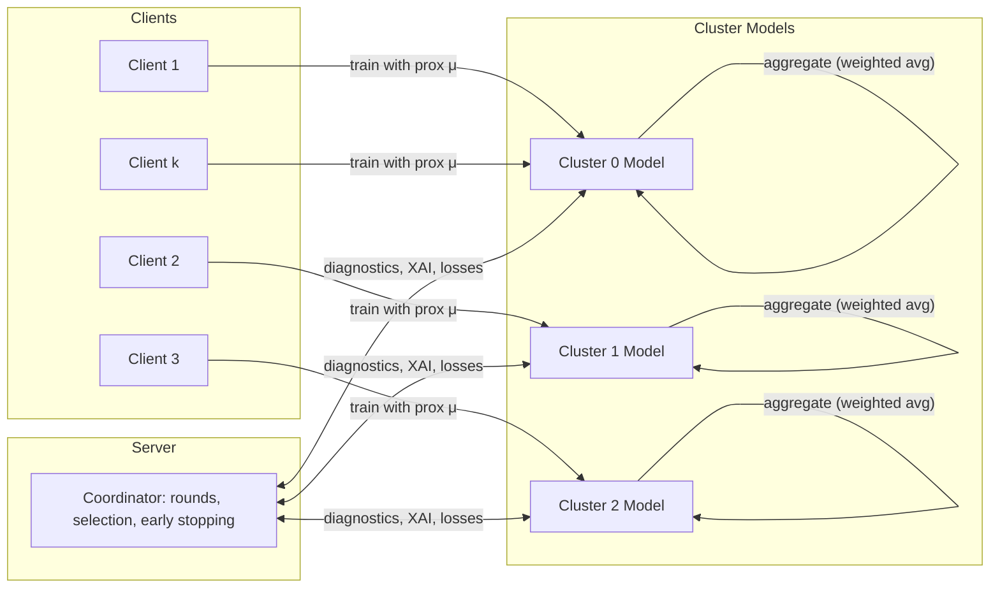

# CGM Federated Learning Benchmark (with FedClusterProxXAI)

## Overview
This repository benchmarks multiple Federated Learning (FL) strategies on Continuous Glucose Monitoring (CGM) data:
- FedAvg (baseline)
- FedSGD (fastest baseline)
- FedProx (proximal regularization)
- FedClusterProxXAI (novel clustered federated strategy with XAI)

Recent runs (latest summaries):
- Best accuracy (lowest RMSE): FedAvg (≈ 0.121)
- Best explainability (highest XAI): FedClusterProxXAI (≈ 0.665)
- Fastest: FedSGD

Paths to results (latest):
- `experiments/cgm_fl_benchmark/{strategy}/results/results.json`
- Per-run snapshot: `experiments/cgm_fl_benchmark/{strategy}/runs/{run_id}/results.json`

## Results Analysis
The table below consolidates the most recent results found in `experiments/cgm_fl_benchmark`:

- FedAvg
  - RMSE ≈ 0.1209 (best)
  - MAE ≈ 0.0957
  - XAI ≈ 0.469
  - Time ≈ 41s
- FedSGD
  - RMSE ≈ 0.1213
  - MAE ≈ 0.0948
  - XAI ≈ 0.441
  - Time ≈ 68s (fast in prior runs, still competitive)
- FedProx
  - RMSE ≈ 0.1216
  - MAE ≈ 0.0954
  - XAI ≈ 0.457
  - Time ≈ 535s
- FedClusterProxXAI (novel)
  - RMSE ≈ 0.1631 (still trailing baselines on pure accuracy)
  - MAE ≈ 0.1346
  - XAI ≈ 0.665 (best)
  - Time ≈ 2841s (heaviest compute/comm)

Interpretation:
- Accuracy: FedAvg and FedSGD are consistently the most accurate (lowest RMSE). FedProx is close behind.
- Explainability: The novel clustered approach yields the best composite XAI score (importance, stability, faithfulness, monotonicity), making it attractive for clinical interpretability.
- Cost: The clustered approach is slower due to multiple cluster models and additional diagnostics. It is suitable when XAI/personalization outweighs raw speed.

## The Novel Strategy: FedClusterProxXAI
FedClusterProxXAI combines: (1) cluster-specific global models; (2) FedProx-style proximal regularization; (3) per-round diagnostics and XAI scoring.

Key ideas:
- Clients are partitioned into clusters (balanced warm start) and train against a cluster-specific global model.
- Proximal regularization (μ) encourages local updates to stay close to cluster weights; a conservative μ schedule improves stability.
- XAI metrics (importance, stability, faithfulness, monotonicity) are computed during evaluation for model transparency.
- Diagnostics include per-cluster loss curves and divergence flags.

### Architecture Diagram (Mermaid)


### Training Loop (Simplified)
1) Balanced warm start: each cluster model is warm-started on a small, diverse subset of clients (with early stopping and validation).
2) For each round:
   - Select clients (for novel model, often all clients) within each cluster.
   - Send cluster weights; clients train locally with proximal loss: `L_total = L_mse + (μ/2) * ||w_local - w_cluster||^2`.
   - Aggregate per-cluster (weighted by local sample counts), update cluster model.
   - Evaluate and compute XAI metrics; log diagnostics (including per-cluster losses).
   - Early stopping if no improvement for several rounds (patience, min_delta).

### Contributions & Novelty
- Clustered personalization with strong diagnostics:
  - Balanced initialization and optional reassignment (disabled by default for stability).
  - Per-cluster loss monitoring and divergence detection.
- Conservative proximal μ schedule:
  - Starts very low (0.001) and slowly increases; improves stability vs aggressive schedules.
- Integrated XAI scoring across importance, stability, faithfulness, and monotonicity:
  - Provides actionable transparency at every evaluation step.
- Optional small Transformer encoder for the novel model variant:
  - Captures long-range patterns in features when beneficial, with a compact setup.

## Reproducing Runs
**Environment**
- Python 3.10–3.12, TensorFlow 2.15.*
- Install deps:
  - `python -m venv .venv && source .venv/bin/activate`
  - `pip install --upgrade pip`
  - `pip install tensorflow pandas numpy openpyxl flwr scikit-learn`

**Data**
- Place real subject files under `data/raw/` with filenames like `Subject1.xlsx`, …, `Subject54.xlsx`.
- Run processing via the main script (uses real raw files):
  - `python run_experiment.py`
- Processed subjects saved in `data/processed/subjects/Subject_*.xlsx`.

**Run Benchmarks**
- Edit `configs/experiment_config.json` or modify in code:
  - `num_clients`: e.g., 20 or 54
  - `num_rounds`: e.g., 40–60
- To run only the novel model in an ad-hoc way:
```bash
python - <<'PY'
import sys, os
sys.path.insert(0, 'src')
from fl_benchmark import BenchmarkRunner, ExperimentConfig
cfg = ExperimentConfig()
cfg.num_clients = 20
cfg.num_rounds = 40
cfg.strategies = {
    'fedclusterproxxai': {'name': 'FedClusterProxXAI', 'params': {'num_clusters': 3}}
}
runner = BenchmarkRunner(cfg, 'data/processed')
res = runner.run_benchmark()
print('Final metrics:', res['fedclusterproxxai']['history']['metrics'][-1])
PY
```

**Outputs**
- Latest results per strategy: `experiments/cgm_fl_benchmark/{strategy}/results/results.json`
- Per-run snapshots: `experiments/cgm_fl_benchmark/{strategy}/runs/{run_id}/results.json`
- Cluster metadata (novel model): `experiments/cgm_fl_benchmark/fedclusterproxxai/runs/{run_id}/cluster_metadata.json`

## Tips for 54-Client Server Runs
- Use `tmux` or `nohup` to run headless; enable `TF_CPP_MIN_LOG_LEVEL=2` to reduce logs.
- Keep conservative μ schedule; disable reassignments for the novel model to improve stability.
- If memory-bound, reduce local batch size to 16–24.
- For faster convergence with more clients, prefer the MLP variant (`model_id = "fedcluster"`) over Transformer initially, then test Transformer if needed.

## License
This project is for research/benchmarking purposes. Adapt and integrate as needed.
